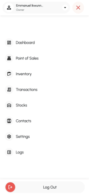

# MarktBook Documentation

## Table of Contents

1. Introduction
2. Features Overview
3. System Requirements
4. User Roles & Permissions
5. Access & Registration
6. User Guide
   - Dashboard
   - Point of Sales
   - Inventory Management
   - Transactions
   - Stock Control
   - Contacts Management
   - Settings
   - Logging 
7. State Management
8. Security Measures
9.  Tutorials and AI usage
10. API Documentation
11. Deployment
12. Future Enhancements

---

## 1. Introduction

MarktBook is an inventory and sales management system tailored for small and medium-sized businesses, especially those with limited technical expertise. The platform features an intuitive user interface and straightforward, practical tools to simplify sales and inventory management. Growing up in Nigeria, West Africa, I was always inspired by shop owners at Alaba International Market who operated large stores, effortlessly memorizing the prices and inventory of every item. Witnessing their dedication, I recognized the need for a tool that could streamline their operations. After completing a significant portion of the Fullstack Open course, I was motivated to create a solution that would make managing their businesses easier. With a core focus on simplicity, the idea for MarktBook was born.

## 2. Features Overview

- **Dashboard**: Overview of reports and analytics
- **Point of Sales (POS)**: Easy-to-use interface for sales transactions.
- **Inventory Management**: Manage, create and update products and stock level.
- **Transactions**: View and manage sales history.
- **Stocks**: Create and manage locations. Monitor stock-in and stock-out operations.
- **Contacts**: Store and manage customer and supplier information.
- **Settings**: Configure system preferences and user permissions.
- **Logs**: Track system activities for security and monitoring.

   

   Fig 1.0. MarktBook menu bar showing its features

## 3. System Requirements

- **Hardware**: PC, Tablet or IPad. Not optimized for mobile screens
- **Software**: Web-based or Mobile App (Progressive Web App compatible)
- **Internet**: Required for operations

## 4. User Roles & Permissions

- **Owner**: Has full system access, including the ability to manage all aspects of the system, configure settings, and access all data.
- **Manager**: Has full system access with the exception of editing certain business account information or deleting the business account. This role can perform most management tasks but with restrictions on sensitive account-level changes.
- **Staff**: Has limited access, primarily restricted to managing inventory, processing transactions, and using the Point of Sale (POS) system.

## 5. Access & Registration

### Accessing MarktBook
To use MarktBook, visit the official domain `[your-domain-name]` from a web browser on any PC, tablet, or mobile device.

### Required Data for Registration
To get started, users must provide the following details:

- **Business Email**
- **Business Name**
- **Full Name**
- **Username**
- **Password**
- **Select Business Category**
- **Select Business Type**

### Logging In
After registration, users can log in using their **Business Email, Username** and **Password**.

### First-Time Setup
After logging in for the first time, it is recommended to fill up business information like currency, tax rate, address, payments information and stock locations. 

## 6. User Guide

### Dashboard

Overview of system analytics and quick access shortcuts.

### Point of Sales

Step-by-step guide on making sales and generating receipts.

### Inventory Management

How to add, edit, and manage product stock.

### Transactions

Viewing and exporting sales transactions.

### Stock Control

Managing stock levels and low-stock alerts.

### Contacts Management

Adding and managing suppliers/customers.

### Settings

Configuring preferences, tax rates, and user permissions.

## 7. State Management

State management is handled using Redux, primarily for managing UI state and handling data fetching/storage. To optimize performance, Redux Persist is used to persist the state, preventing unnecessary data fetching when the page reloads. Additionally, sensitive data such as the user token is encrypted using Redux Encrypt for enhanced security.

## 8. Security Measures  

- **Password Encryption:** User passwords are encrypted using the **bcrypt** library before being stored in the database. During authentication, passwords are securely compared using bcrypt's hashing mechanism.  

- **Token-Based Authentication:** Upon successful login, a **JWT (JSON Web Token)** is generated and attached to the session. This token is also sent to the client, where it is **encrypted** and stored in **local storage**. Each session expires after **24 hours**, after which the token is invalidated.  

- **CORS Configuration:** Cross-Origin Resource Sharing (CORS) is configured to only accept requests from a specified client. This ensures that only requests coming from the configured client’s domain(s) are allowed to interact with the server. This prevents unauthorized domains from accessing the API. The CORS settings are configured as follows:  
  - Only the **configured domain(s)** are allowed to make requests to the API.
  - All other domains will be blocked, ensuring the security of the API from cross-origin attacks.

- **Rate Limiting:** To prevent abuse and enhance security, **request limiting** is implemented for critical actions:  
  - **Login attempts**: Limited to **50 requests per hour**.  
  - **User registration**: Limited to **5 requests per hour**.  
  - **Password reset requests**: Limited to **5 requests per 30 minutes**.  

These measures help protect against brute-force attacks, prevent excessive API requests, and ensure a secure user authentication process.

## 9. Tutorials and AI usage

I followed a Udemy tutorial [Node with React: Build & Deploy a Fullstack Web Application](https://www.udemy.com/course/node-with-react-build-deploy-a-fullstack-web-application/) course to learn the practical application of several backend technologies, such as caching with Redis and session management. Prior to this, I was unsure about how to structure my project files, and the tutorial provided a well-organized structure that I adopted.

The tutorial also used Object-Oriented Programming (OOP) coding like style, which I applied when setting up the server, database, controllers, and services in my backend. While I made significant modifications to adapt the tutorial to my project’s needs, such as shifting from a social media app to my own unique use case, I still used several code snippets from the tutorial’s codebase in various parts of my backend implementation. [Link to tutorial codebase](https://github.com/uzochukwueddie/chatty-backend)

In addition, I leveraged Large Language Models (LLMs) such as ChatGPT, Claude, and GitHub Copilot in VS Code for debugging and refining my code logic in several areas. These AI tools assisted in identifying potential issues, optimizing code, and providing suggestions for improvements, helping me streamline development and enhance the quality of my codebase

## 10. API Documentation
I used Swagger to document the API endpoints for the project. While approximately 78% of the endpoints are documented, some sections may not be entirely accurate, as I performed several backend refactorings while working on the frontend.

Although the documentation is still a work in progress, I plan to complete it soon. However, due to time constraints, this has affected my progress in other areas of the project. You can access the current API documentation at the following link: [Link to api docs](https://marktbook-backend.fly.dev/api/v1/api-docs).

Please note that you need to be logged in to access the documentation.

## 11. Deployment

The backend is currently deployed on Fly.io, and I have set up a CI/CD pipeline that automates the deployment process. I initially attempted to deploy on Azure Apps, but faced challenges due to having both the frontend and backend code in the same repository.

For the frontend, I opted to deploy it as a static site on Azure Apps, which was a more straightforward approach. The deployment process for the frontend is also automated using a GitHub Actions CI/CD pipeline, ensuring smooth and continuous deployment whenever changes are made.

## 12. Future Enhancements

Planned updates and feature roadmap.
