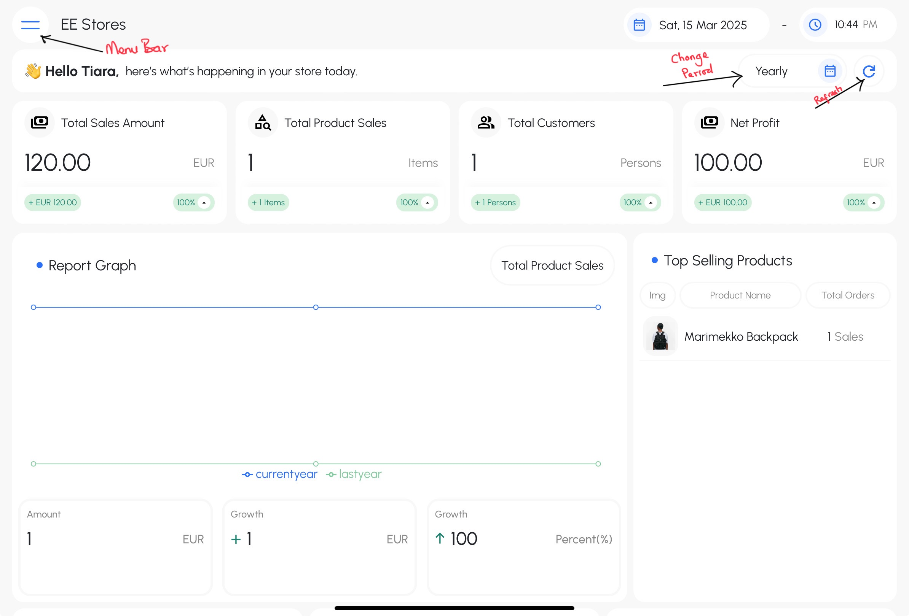
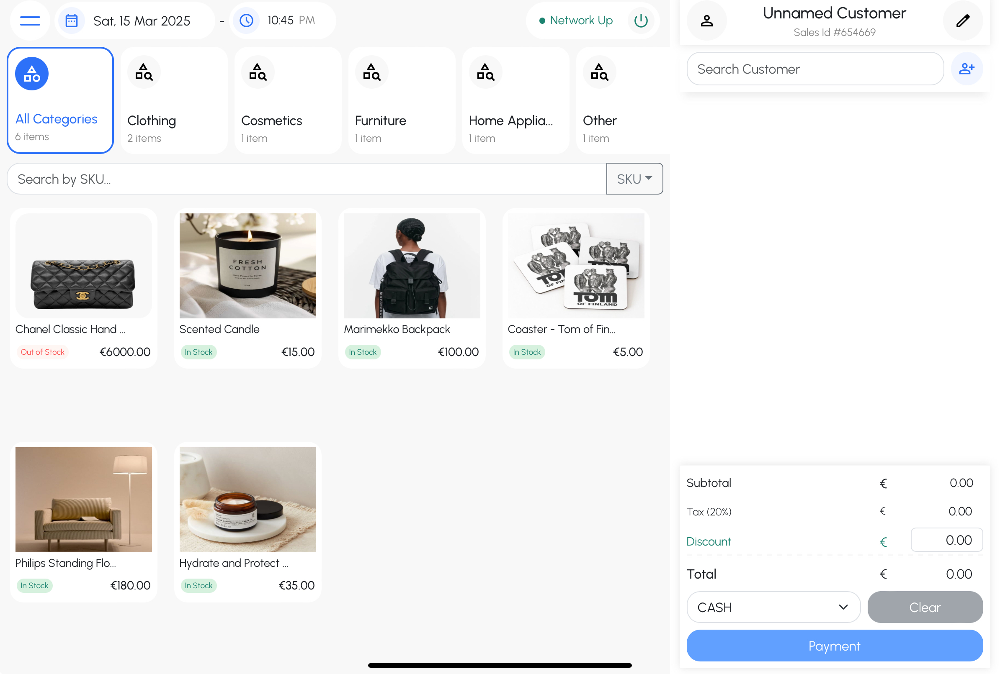
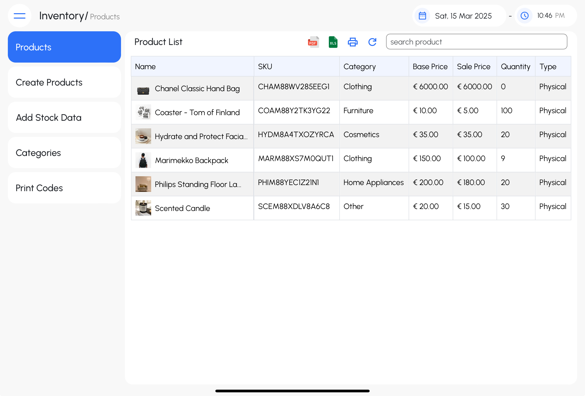
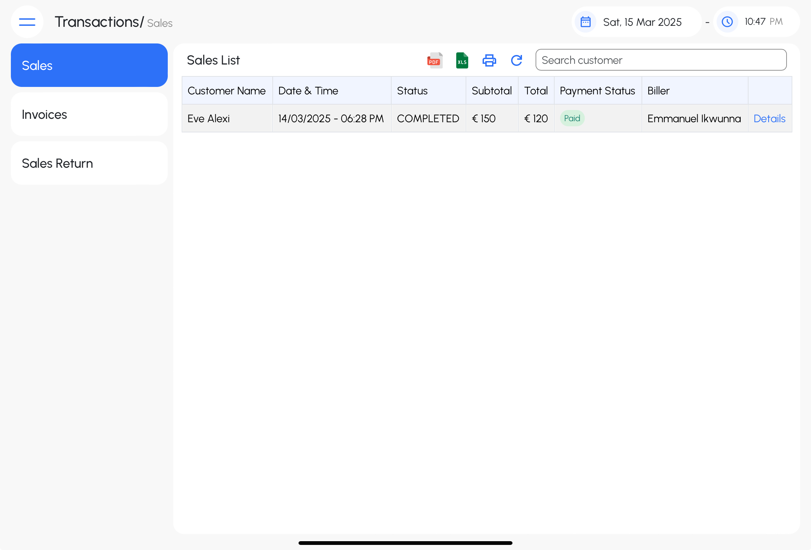
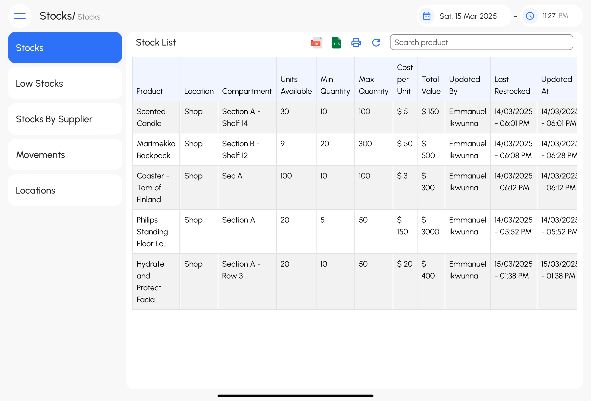
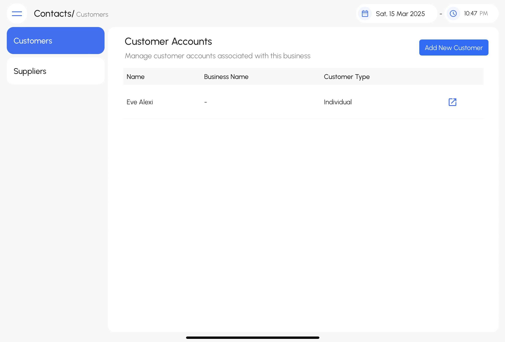
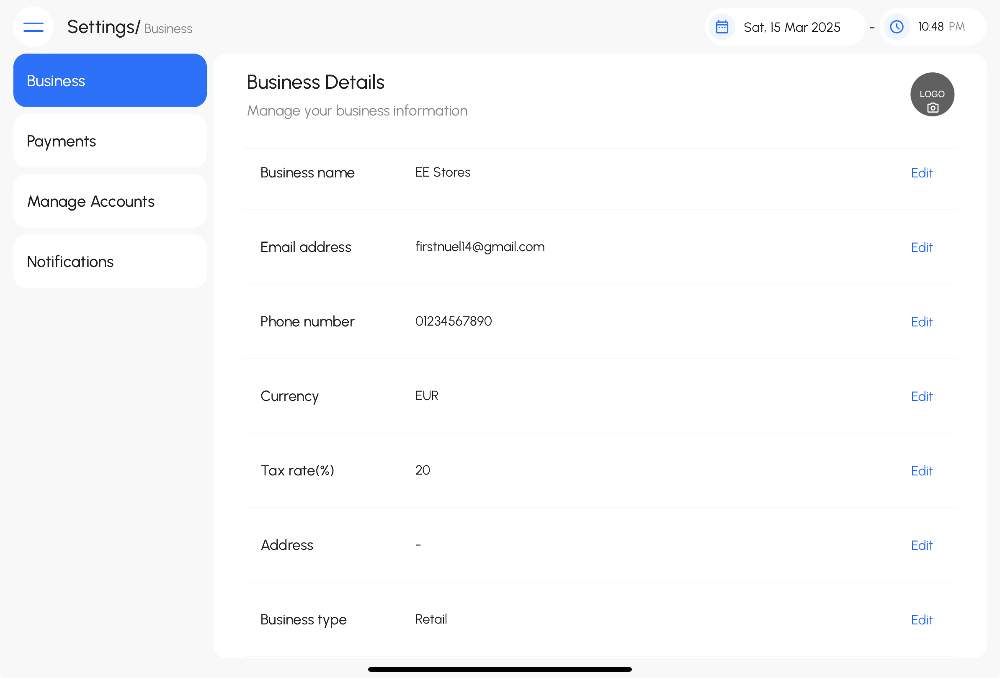
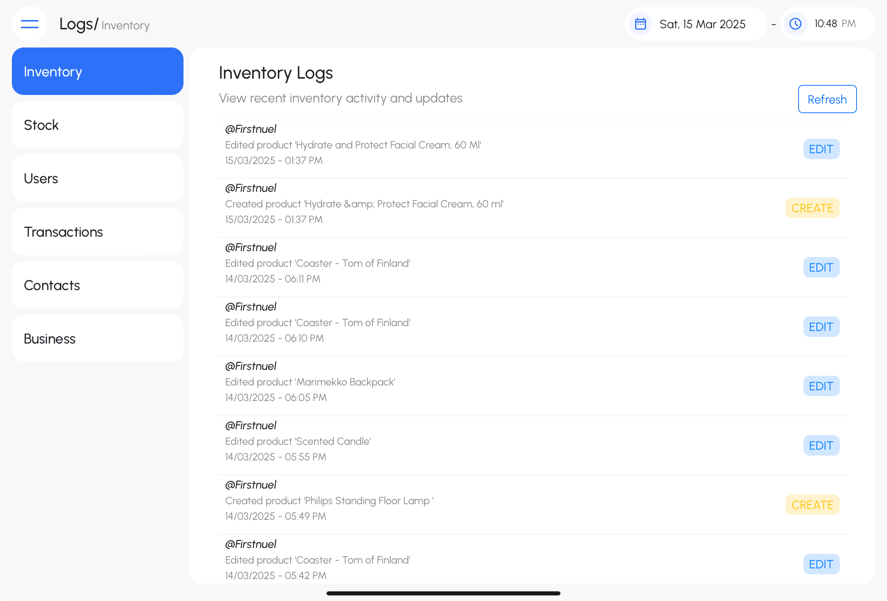

# MarktBook Documentation

## Table of Contents

1. Introduction  
2. Features Overview  
3. System Requirements  
4. Technology Used  
5. User Roles & Permissions  
6. Access & Registration  
7. User Guide  
   - Dashboard  
   - Point of Sale  
   - Inventory Management  
   - Transactions  
   - Stock Control  
   - Contacts Management  
   - Settings  
   - Logging  
8. State Management  
9. Security Measures  
10. Tutorials and AI Usage  
11. API Documentation  
12. Deployment  
13. Future Enhancements  

---

## 1. Introduction

MarktBook is an inventory and sales management system tailored for small and medium-sized businesses, especially those with limited technical expertise. The platform features an intuitive user interface and straightforward, practical tools to simplify sales and inventory management. Growing up in Nigeria, West Africa, I was always inspired by shop owners at Alaba International Market who operated large stores, effortlessly memorizing the prices and inventory of every item. Witnessing their dedication, I recognized the need for a tool that could streamline their operations. After completing a significant portion of the Fullstack Open course, I was motivated to create a solution that would make managing their businesses easier. With a core focus on simplicity, the idea for MarktBook was born.

## 2. Features Overview

- **Dashboard**: Overview of reports and analytics
- **Point of Sales (POS)**: Easy-to-use interface for sales transactions.
- **Inventory Management**: Manage, create and update products and stock level.
- **Transactions**: View and manage sales history.
- **Stocks**: Create and manage locations. Monitor stock-in and stock-out operations.
- **Contacts**: Store and manage customer and supplier information.
- **Settings**: Configure system preferences and user permissions.
- **Logs**: Track system activities for security and monitoring.

   

   Fig 1.0. MarktBook menu bar showing its features

## 3. System Requirements

- **Hardware**: PC, Tablet or IPad. Not optimized for mobile screens
- **Software**: Web-based or Mobile App (Progressive Web App compatible)
- **Internet**: Required for operations
- **Hardware**: PC, Tablet or IPad. Not optimized for mobile screens
- **Software**: Web-based or Mobile App (Progressive Web App compatible)
- **Internet**: Required for operations

## 4. Technology Used  

This application is primarily developed using **TypeScript**. The backend is powered by **Node.js** with **Express** as the server framework. The frontend is built using **React**, providing a dynamic and interactive user experience.  

For data storage, **MongoDB** is used as the database, ensuring flexibility and scalability. **Redis** is implemented for caching, improving performance and reducing load times.  

## 5. User Roles & Permissions

- **Owner**: Has full system access, including the ability to manage all aspects of the system, configure settings, and access all data.

- **Manager**: Has full system access with the exception of editing certain business account information or deleting the business account. This role can perform most management tasks but with restrictions on sensitive account-level changes.

- **Staff**: Has limited access, primarily restricted to managing inventory, processing transactions, and using the Point of Sale (POS) system.

## 6. Access & Registration

### Accessing MarktBook
To use MarktBook, visit the official domain `[your-domain-name]` from a web browser on any PC, tablet, or mobile device.

### Required Data for Registration
To get started, users must provide the following details:

- **Business Email**
- **Business Name**
- **Full Name**
- **Username**
- **Password**
- **Select Business Category**
- **Select Business Type**

### Logging In
After registration, users can log in using their **Business Email, Username** and **Password**.

### First-Time Setup
After logging in for the first time, it is recommended to fill up business information like currency, tax rate, address, payments information and stock locations. 

## 6. User Guide

### Dashboard

The dashboard provides a quick overview of key store data. It consists of eight sections:  

- **Sales Data Boxes** – Displays key sales metrics at a glance.  
- **Report Graph** – Visual representation of sales trends over time.  
- **Top Selling Products** – Highlights the best-performing products.  
- **Low Stock Alerts** – Identifies products that need restocking.  
- **Inventory Visualization** – Offers insights into current stock levels.  
- **Business Account Users** – Lists active users with access to the system.  
- **Recent Sales** – Shows the latest transactions for quick reference.  
- **Top Categories** – Highlights the most popular product categories.  

This structured layout helps users quickly access important business insights. 

### Point of Sale  
  

The Point of Sale (POS) interface enables users to process sales efficiently. It consists of several key sections:  

- **Category Filter Boxes** – Allows users to filter products by category.  
- **Search Bar** – Enables users to search for items using SKU, product name, category, tags, or barcode.  
- **Product Boxes** – Displays product images, names, and prices. Clicking on a product provides more details and an option to add it to the cart.  
- **Cart Section** – Shows selected items. Users can search for an existing customer or add a new customer before completing a sale.  

This interface streamlines the sales process, making transactions quick and intuitive.  

### Inventory Management  
  

The Inventory Management section is divided into five key areas:  

- **Products** – Displays products in a tabular format, with options to export the list as PDF, CSV, or print directly. Each product is clickable, allowing users to view and edit product details in an editable form.  
- **Create Products** – Provides an interface and form to add new products to the inventory.  
- **Add Stock Data** – Allows users to update and manage stock levels for existing products.  
- **Categories** – Enables the management of product categories and viewing of products by category.  
- **Print Codes** – Allows users to generate and print barcodes for products using their generated SKUs.  

This section helps keep inventory organized and makes managing products and stock more efficient.  

#### Transactions  
  

The Transactions section is divided into three key areas:  

- **Sales** – Displays all sales in a tabular format, with options to export the list as CSV, PDF, or print directly. Each sale can be expanded for detailed view and management.  
- **Invoices** – Shows completed and pending sales. Users can click to view or print the generated invoices for each sale.  
- **Sales Returns** – Lists returned and/or refunded sales and provides an interface to process new returns.  

This section enables efficient tracking and management of sales, invoices, and returns.  

### Stock Control  
  

The Stock Control section helps manage inventory and stock movement effectively. It is divided into the following areas:  

- **Stocks** – Displays the current stock levels of all products in the inventory.  
- **Low Stocks** – Highlights products that are running low in stock, helping users to restock on time.  
- **Stocks by Supplier** – Allows users to view stock levels based on the supplier, providing better visibility of supplier-specific products.  
- **Movements** – Tracks product movements, including stock additions and removals, for better inventory tracking.  
- **Locations** – Manages stock based on different store locations, helping users keep track of inventory across multiple sites.  

This section ensures that stock is effectively monitored and managed, reducing the risk of stockouts or excess inventory.  

### Contacts Management  
  

The Contacts Management section allows users to add and manage both suppliers and customers. It is divided into the following areas:  

- **Customers** – Displays all customers and provides an interface for adding new customers to the system.  
- **Suppliers** – Displays all suppliers and provides an interface for adding new suppliers.  

This section helps organize and maintain essential contact information for both customers and suppliers, streamlining communication and management.  

### Settings  
  

The Settings section allows users to configure various aspects of the application. It is divided into the following areas:  

- **Business** – Manage business information, including address, name, logo, tax rates, and other details.  
- **Payments** – Set up bank account details used when generating invoices. **POS Terminal** integration is currently unavailable.  
- **Manage Accounts** – Add, edit, or delete user accounts to control access to the system.  
- **Notifications** – Manage notification preferences, allowing users to customize how and when they receive alerts.  

This section provides administrative control over essential application settings, enabling smooth business operations.  

### Logs  
  

The Logs section keeps a record of key activities and changes within the system. It is divided into the following areas:  

- **Inventory** – Tracks changes made to the inventory, such as stock additions, removals, or edits.  
- **Stock** – Logs movements and adjustments in stock levels, helping monitor product flow.  
- **Users** – Records user activity, including login attempts, account changes, and role modifications.  
- **Transactions** – Logs details of sales, refunds, and other transaction-related activities for audit purposes.  
- **Contacts** – Tracks changes made to supplier and customer information, ensuring contact records are up-to-date.  
- **Business** – Records changes made to business settings, such as address, logo, tax rates, and other important configurations.  

This section helps administrators monitor and audit key system activities, ensuring transparency and accountability.  

## 8. State Management

State management is handled using Redux, primarily for managing UI state and handling data fetching/storage. To optimize performance, Redux Persist is used to persist the state, preventing unnecessary data fetching when the page reloads. Additionally, sensitive data such as the user token is encrypted using Redux Encrypt for enhanced security.

## 9. Security Measures  

- **Password Encryption:** User passwords are encrypted using the **bcrypt** library before being stored in the database. During authentication, passwords are securely compared using bcrypt's hashing mechanism.  

- **Token-Based Authentication:** Upon successful login, a **JWT (JSON Web Token)** is generated and attached to the session. This token is also sent to the client, where it is **encrypted** and stored in **local storage**. Each session expires after **24 hours**, after which the token is invalidated.  

- **CORS Configuration:** Cross-Origin Resource Sharing (CORS) is configured to only accept requests from a specified client. This ensures that only requests coming from the configured client’s domain(s) are allowed to interact with the server. This prevents unauthorized domains from accessing the API. The CORS settings are configured as follows:  
  - Only the **configured domain(s)** are allowed to make requests to the API.
  - All other domains will be blocked, ensuring the security of the API from cross-origin attacks.

- **Rate Limiting:** To prevent abuse and enhance security, **request limiting** is implemented for critical actions:  
  - **Login attempts**: Limited to **50 requests per hour**.  
  - **User registration**: Limited to **5 requests per hour**.  
  - **Password reset requests**: Limited to **5 requests per 30 minutes**.  

These measures help protect against brute-force attacks, prevent excessive API requests, and ensure a secure user authentication process.

## 10. Tutorials and AI usage

I followed a Udemy tutorial [Node with React: Build & Deploy a Fullstack Web Application](https://www.udemy.com/course/node-with-react-build-deploy-a-fullstack-web-application/) course to learn the practical application of several backend technologies, such as caching with Redis and session management. Prior to this, I was unsure about how to structure my project files, and the tutorial provided a well-organized structure that I adopted.

The tutorial also used Object-Oriented Programming (OOP) coding like style, which I applied when setting up the server, database, controllers, and services in my backend. While I made significant modifications to adapt the tutorial to my project’s needs, such as shifting from a social media app to my own unique use case, I still used several code snippets from the tutorial’s codebase in various parts of my backend implementation. [Link to tutorial codebase](https://github.com/uzochukwueddie/chatty-backend)

In addition, I leveraged Large Language Models (LLMs) such as ChatGPT, Claude, and GitHub Copilot in VS Code for debugging and refining my code logic in several areas. These AI tools assisted in identifying potential issues, optimizing code, and providing suggestions for improvements, helping me streamline development and enhance the quality of my codebase

## 11. API Documentation
I used Swagger to document the API endpoints for the project. While approximately 78% of the endpoints are documented, some sections may not be entirely accurate, as I performed several backend refactorings while working on the frontend.

Although the documentation is still a work in progress, I plan to complete it soon. However, due to time constraints, this has affected my progress in other areas of the project. You can access the current API documentation at the following link: [Link to api docs](https://marktbook-backend.fly.dev/api/v1/api-docs).

Please note that you need to be logged in to access the documentation.

## 12. Deployment

The backend is currently deployed on Fly.io, and I have set up a CI/CD pipeline that automates the deployment process. I initially attempted to deploy on Azure Apps, but faced challenges due to having both the frontend and backend code in the same repository.

For the frontend, I opted to deploy it as a static site on Azure Apps, which was a more straightforward approach. The deployment process for the frontend is also automated using a GitHub Actions CI/CD pipeline, ensuring smooth and continuous deployment whenever changes are made.

## 13. Future Enhancements  

For thisproject, the following features may be considered for future implementation if time and resources allow:  

- **Mobile Screen Support**:  
  Currently, the application is not fully optimized for smaller screens due to time constraints during development. In the future, I may explore using styling frameworks to improve responsiveness and streamline the design process.  

- **Pagination**:  
  Implementing pagination for data display and fetching could enhance performance and user experience, particularly when handling large datasets.  

- **Mail Services**:  
  At present, the application supports basic email notifications for password resets and updates. Expanding this functionality to include registration confirmations, transaction receipts, and system alerts is a potential enhancement.  

- **Notifications**:  
  Adding a notification system could help users stay informed about important updates, such as order status changes, low stock alerts, or system messages.  

- **POS Terminal Integration**:  
  In the future, integrating **Point of Sale (POS) terminals** may be explored to enable transactions through external payment hardware, making the application more suitable for retail environments.  

These enhancements are subject to further learning and development based on available time and project scope.  

